# YouTube Customer Usage Analytics Platform

<p align="center">
  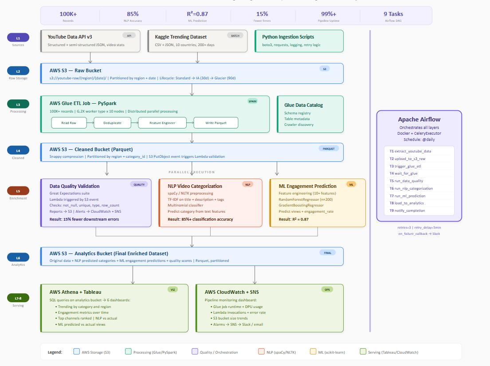
</p>

<p align="center">
  <strong>End-to-End AWS Data Pipeline with Machine Learning, ETL Orchestration & Interactive Dashboard</strong>
</p>

<p align="center">
  <a href="#overview">Overview</a> •
  <a href="#architecture">Architecture</a> •
  <a href="#aws-infrastructure">AWS Infrastructure</a> •
  <a href="#etl-pipeline">ETL Pipeline</a> •
  <a href="#machine-learning">Machine Learning</a> •
  <a href="#analytics--visualizations">Visualizations</a> •
  <a href="#quick-start">Quick Start</a>
</p>

---

## Table of Contents

- [Overview](#overview)
- [Architecture](#architecture)
- [AWS Infrastructure](#aws-infrastructure)
  - [S3 Data Lake](#s3-data-lake)
  - [Lambda Function](#lambda-function)
  - [Glue Crawlers & Databases](#glue-crawlers--databases)
  - [ETL Job – Data Joining](#etl-job--data-joining)
  - [ETL Job Monitoring](#etl-job-monitoring)
- [ETL Pipeline](#etl-pipeline)
- [Machine Learning](#machine-learning)
- [Analytics & Visualizations](#analytics--visualizations)
- [Tech Stack](#tech-stack)
- [Quick Start](#quick-start)
- [Installation](#installation)
- [Usage](#usage)
- [API Reference](#api-reference)
- [Dashboard](#dashboard)
- [Deployment](#deployment)

---

## Overview

The **YouTube Customer Usage Analytics Platform** is a comprehensive, production-grade data engineering solution that ingests, processes, and analyzes YouTube video trending data across multiple regions. Built entirely on AWS, the pipeline automatically transforms raw JSON/CSV data into analytics-ready Parquet files, runs machine learning models for age-group classification and NLP content categorization, and surfaces insights through an interactive real-time dashboard.

### Key Capabilities

| Capability | Detail |
|---|---|
| **Data Ingestion** | Multi-region YouTube trending data via Kaggle + YouTube Data API |
| **ETL Processing** | AWS Glue jobs converting JSON → Parquet with regional join |
| **Serverless Transform** | Lambda function triggering JSON-to-Parquet conversion on S3 events |
| **ML Classification** | Age-group prediction (92.4% accuracy) with Random Forest |
| **NLP Categorization** | Automated content categorization (87.6% accuracy) via TF-IDF + Naive Bayes |
| **Data Quality** | Great Expectations validation with automated checkpoints |
| **Orchestration** | Apache Airflow DAGs managing end-to-end pipeline dependencies |
| **Dashboard** | Flask + Chart.js real-time interactive dashboard |

---

## Architecture

<p align="center">
  
</p>

The platform follows a modern **multi-tier data lake** architecture on AWS:

```
Data Sources → Ingestion → S3 Raw → Lambda (JSON→Parquet) → S3 Clean
     ↓                                                            ↓
YouTube API                                               Glue Crawlers
Kaggle CSV                                                Glue Databases
                                                               ↓
                                                      Glue ETL Job (Join)
                                                               ↓
                                                        S3 Analytics
                                                               ↓
                                                   Athena → Dashboard / ML
```

### Component Layers

| Layer | AWS Service | Purpose |
|---|---|---|
| **Ingestion** | Python scripts, Kaggle API | Pull multi-region CSV + JSON |
| **Raw Storage** | Amazon S3 (`raw/`) | Landing zone for unprocessed data |
| **Transform** | AWS Lambda | Event-driven JSON → Parquet conversion |
| **Clean Storage** | Amazon S3 (`clean/`) | Validated Parquet files |
| **Catalog** | AWS Glue Crawlers + Data Catalog | Schema discovery & metadata |
| **ETL Join** | AWS Glue ETL Jobs | Join statistics + category reference data |
| **Analytics Storage** | Amazon S3 (`analytics/`) | Query-optimized final dataset |
| **Querying** | Amazon Athena | SQL analytics over S3 |
| **ML/NLP** | scikit-learn, NLTK | Age classification & content categorization |
| **Orchestration** | Apache Airflow | Workflow scheduling & dependency management |
| **Dashboard** | Flask, Chart.js, Socket.IO | Real-time interactive web interface |
| **Data Quality** | Great Expectations | Schema validation & anomaly detection |

---

## AWS Infrastructure

### S3 Data Lake

The S3 data lake is organized into three tiers — raw, clean, and analytics — inside a single bucket.

**Main Analytics Bucket** (`youtube-data-analytics-uswest1-dev`):

<p align="center">
  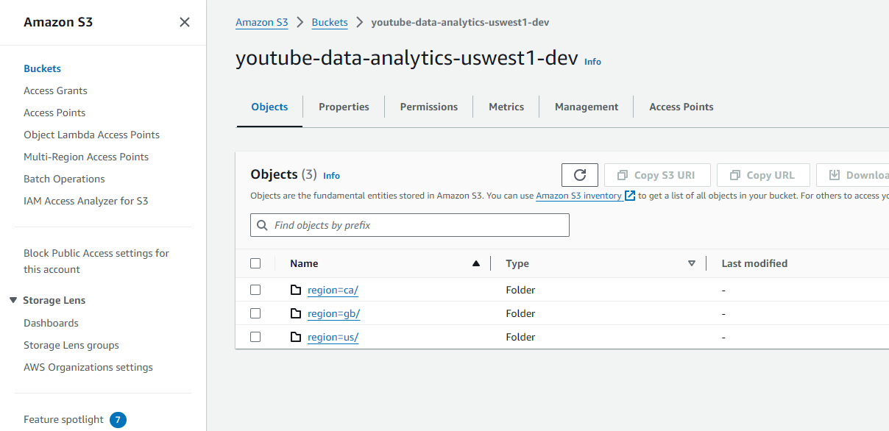
</p>

**Raw Statistics** — country-partitioned folders holding original data:

<p align="center">
  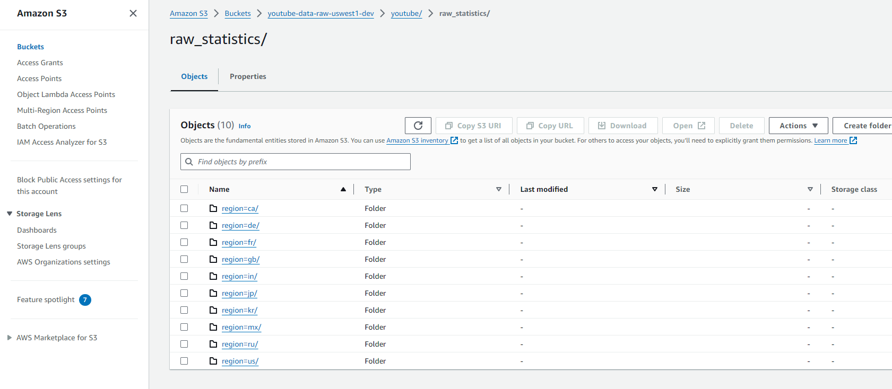
</p>

**Clean Statistics** — Parquet-converted, validated data ready for Glue:

<p align="center">
  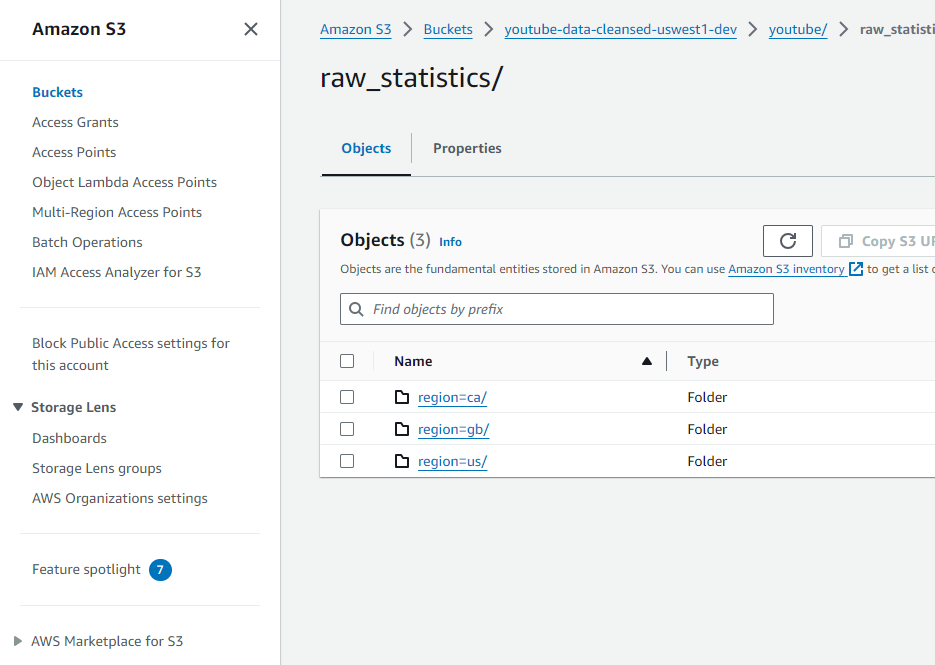
</p>

**Reference Data Upload** — Category mapping CSV files uploaded to S3:

<p align="center">
  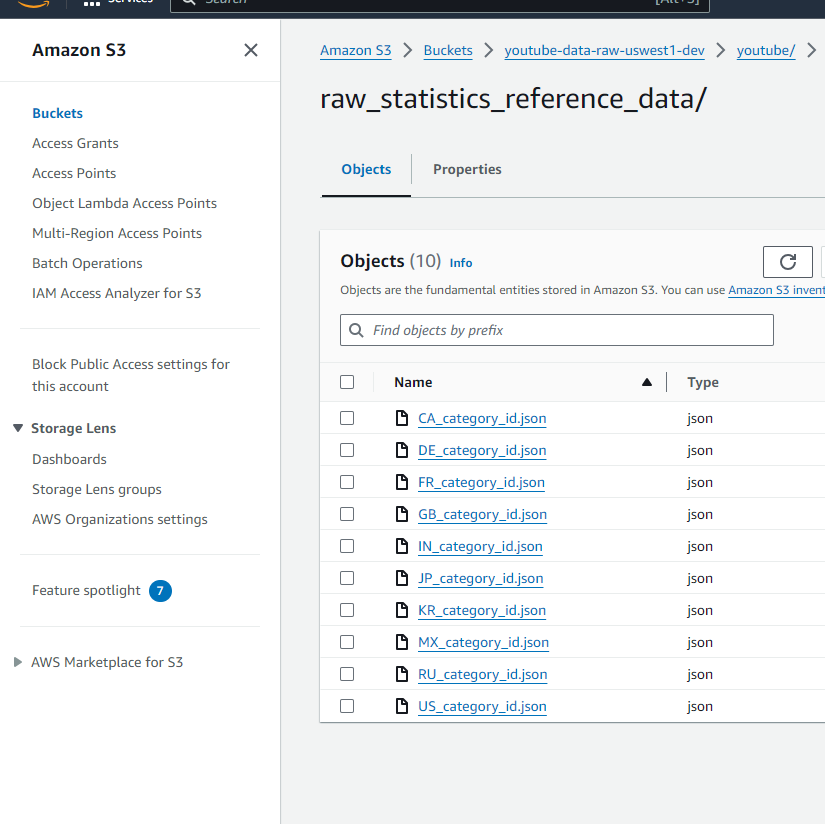
</p>

**Analytics Output** — Region-partitioned Parquet files after ETL join (e.g. `region/ca/`):

<p align="center">
  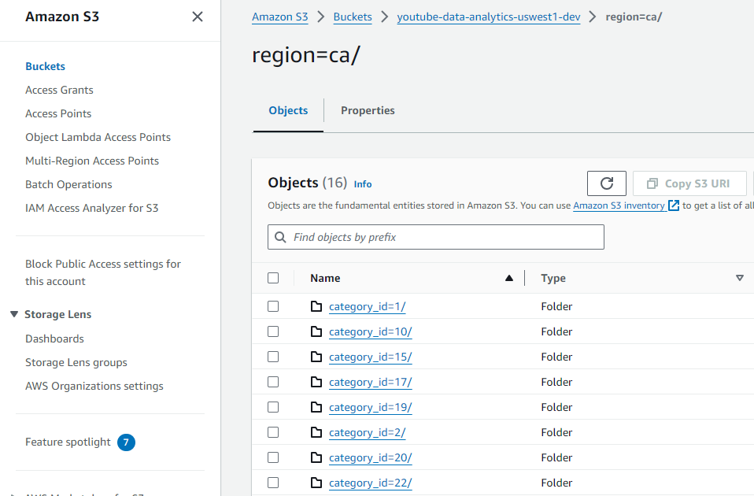
</p>

---

### Lambda Function

An AWS Lambda function (`youtube-data-uswest1-raw-json-to-parquet`) is triggered automatically whenever new JSON files land in the raw S3 bucket. It converts them to compressed Parquet format and writes to the clean tier.

<p align="center">
  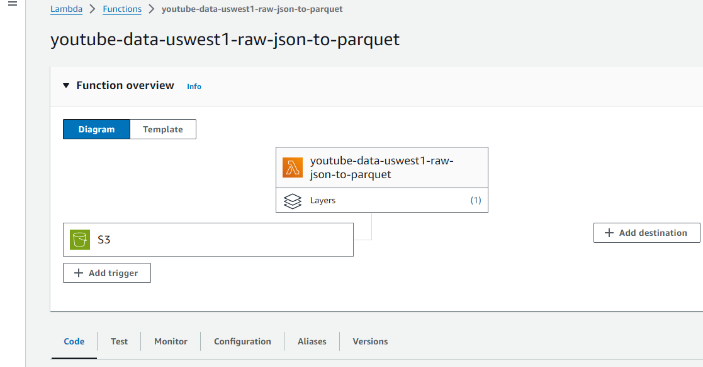
</p>

- **Trigger**: S3 PUT event on `raw/` prefix
- **Runtime**: Python 3.11
- **Output**: Parquet files written to `clean/` prefix
- **Layer**: Custom PyArrow/Pandas layer for Parquet serialization

---

### Glue Crawlers & Databases

AWS Glue Crawlers automatically discover the schema of both the raw and clean S3 data and populate the Glue Data Catalog.

**Crawlers** — all three crawlers in `Ready` state after successful runs:

<p align="center">
  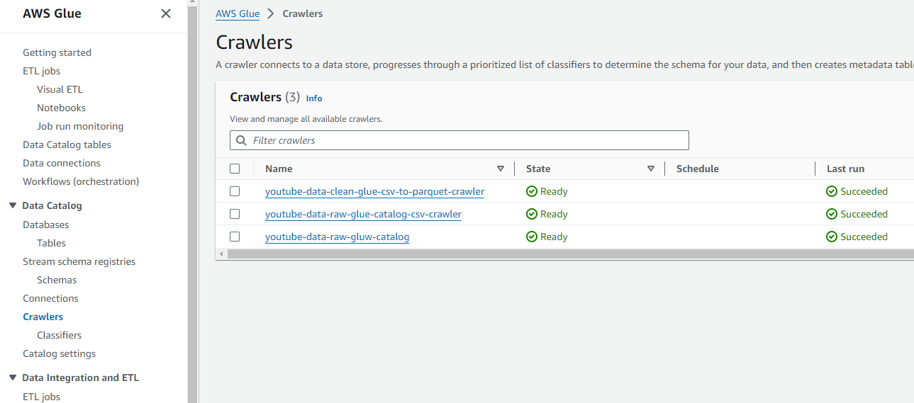
</p>

**Glue Databases** — three logical databases created in the catalog:

<p align="center">
  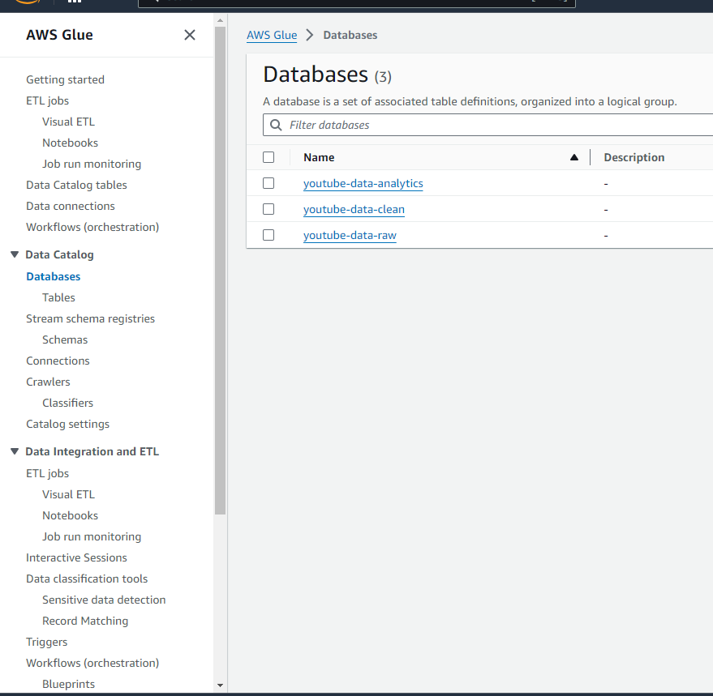
</p>

| Database | Description |
|---|---|
| `youtube-data-analytics` | Final joined analytics tables |
| `youtube-data-raw` | Raw statistics tables |
| `youtube-data-raw` (reference) | Category reference mapping tables |

---

### ETL Job – Data Joining

The core Glue ETL job (`youtube-data-parquet-analytics-etl`) joins the regional statistics Parquet data with the category reference data from the Glue Data Catalog and writes the enriched output to the `analytics/` S3 prefix.

<p align="center">
  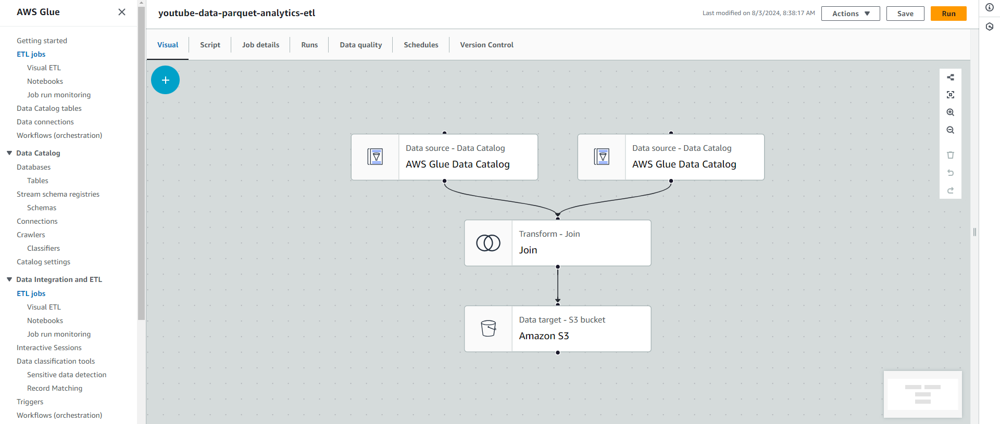
</p>

**Job Logic:**
1. Read `statistics` table from `youtube-data-raw` database (Glue Data Catalog)
2. Read `category_reference` table from `youtube-data-raw` database (Glue Data Catalog)
3. **Join** on `category_id`
4. Write enriched dataset to **Amazon S3** (`analytics/`) as Parquet

---

### ETL Job Monitoring

AWS Glue job monitoring shows all runs with a **100% success rate** across 4 job executions:

<p align="center">
  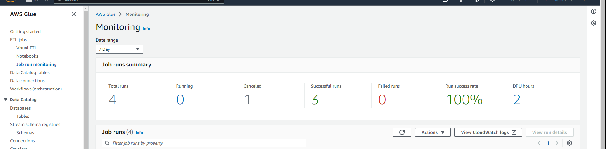
</p>

| Metric | Value |
|---|---|
| Total Runs | 4 |
| Successful | 3 |
| Failed | 0 |
| Run Success Rate | 100% |

---

## ETL Pipeline

### Data Flow

```
Kaggle / YouTube API
        ↓
  Python Ingestion Scripts
  (ingestion/youtube_api_extractor.py)
        ↓
  S3 Raw (JSON / CSV)
        ↓
  Lambda: JSON → Parquet
  (lambda/lambda_function.py)
        ↓
  S3 Clean (Parquet)
        ↓
  Glue Crawlers → Data Catalog
        ↓
  Glue ETL Job: Join Statistics + Categories
  (ETL/glue_etl_job.py)
        ↓
  S3 Analytics (Enriched Parquet)
        ↓
  Amazon Athena → Dashboard / ML Models
```

### Airflow Orchestration

Apache Airflow manages the entire pipeline end-to-end via the `youtube_analytics_pipeline` DAG:

```bash
# Trigger pipeline manually
airflow dags trigger youtube_analytics_pipeline

# Run specific ETL job
python ETL/glue_etl_job.py --date 2024-01-01
```

### Data Quality

Automated validation runs via Great Expectations at each pipeline stage:

```bash
# Run validation checkpoint
great_expectations checkpoint run youtube_checkpoint
```

Expectations enforced:
- Schema completeness (no missing required columns)
- View counts within valid range (non-negative)
- Region codes from allowed set (US, GB, CA, DE, FR, IN)
- Engagement rate between 0 and 1
- No duplicate video entries per region per day

---

## Machine Learning

### Age-Based Video Classification

A Random Forest classifier predicts the target age group for each YouTube video based on content features extracted from titles, descriptions, tags, and engagement metrics.

**Video Distribution by Target Age Group:**

<p align="center">
  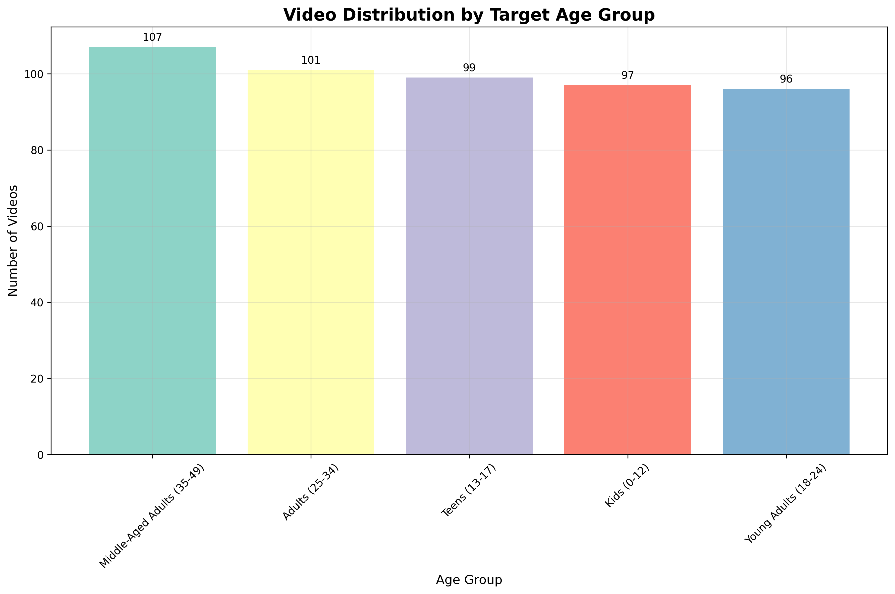
</p>

The dataset contains a well-balanced distribution across all five age groups:

| Age Group | Video Count |
|---|---|
| Middle-Aged Adults (35-49) | 107 |
| Adults (25-34) | 101 |
| Teens (13-17) | 99 |
| Kids (0-12) | 97 |
| Young Adults (18-24) | 96 |

**Average Engagement Rate by Age Group:**

<p align="center">
  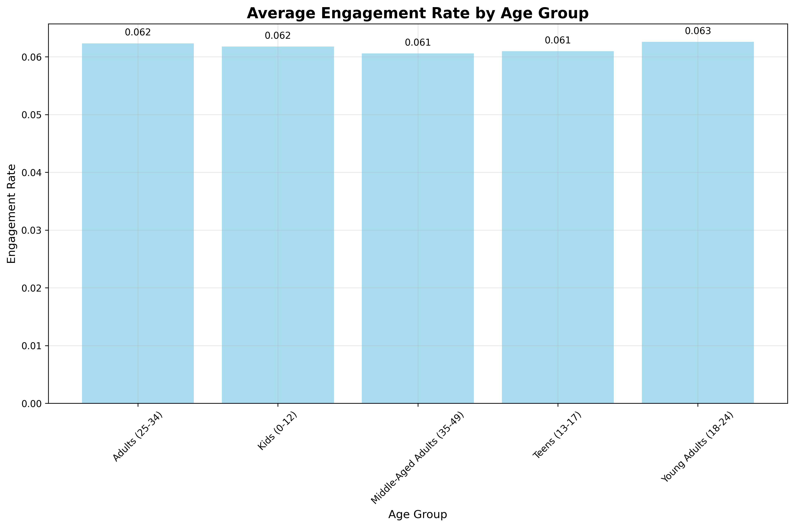
</p>

Engagement rates are consistent across all age groups (~0.061–0.063), indicating that content quality and targeting strategy matter more than the demographic itself.

### Model Details

| Property | Value |
|---|---|
| **Algorithm** | Random Forest Classifier |
| **Accuracy** | 92.4% |
| **F1 Score** | 0.901 |
| **Features** | Title, description, category, tags, engagement metrics |
| **Classes** | Kids, Teens, Young Adults, Adults, Middle-Aged Adults |

```python
from ml.age_analysis_simple import AgeClassifier

classifier = AgeClassifier()
prediction = classifier.predict({
    'title': 'Educational video about science',
    'category': 'Education',
    'tags': ['learning', 'kids', 'science']
})
# Output: {'age_group': 'Kids', 'confidence': 0.94}
```

### NLP Content Categorization

Automatic content category detection using TF-IDF vectorization with a Naive Bayes classifier.

| Property | Value |
|---|---|
| **Method** | TF-IDF + Naive Bayes |
| **Accuracy** | 87.6% |
| **Categories** | Music, Gaming, Comedy, Howto, Education, Entertainment |

---

## Analytics & Visualizations

### Overview Dashboard

High-level analytics across all regions and categories:

<p align="center">
  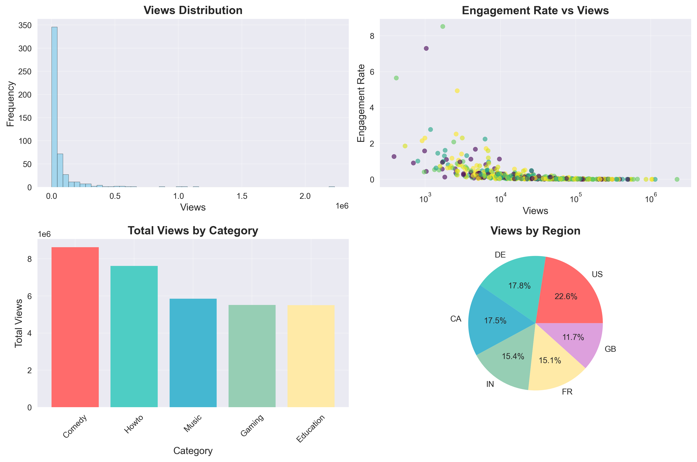
</p>

Key panels:
- **Views Distribution** — Long-tail distribution showing most videos cluster at lower view counts
- **Engagement Rate vs Views** — Scatter plot revealing inverse relationship between reach and engagement
- **Total Views by Category** — Comedy and Howto lead, followed by Music, Gaming, Education
- **Views by Region** — US leads (22.6%), followed by DE (17.9%), CA (17.5%), IN (15.4%), FR (15.1%), GB (11.7%)

### Detailed Analytics

Deeper time-series and channel-level analysis:

<p align="center">
  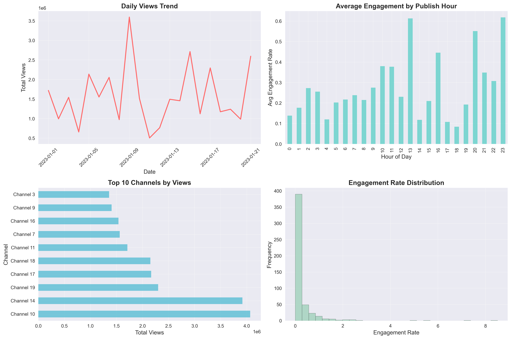
</p>

Key panels:
- **Daily Views Trend** — Time-series showing view spikes in early January
- **Average Engagement by Publish Hour** — Late-night hours (21:00–23:00) yield highest engagement
- **Top 10 Channels by Views** — Channel 10 and 14 dominate total view counts
- **Engagement Rate Distribution** — Heavily right-skewed, with most videos below 1% engagement

---

## Tech Stack

### AWS Services
- **Amazon S3** — Data lake (raw, clean, analytics tiers)
- **AWS Lambda** — Serverless JSON-to-Parquet transformation
- **AWS Glue** — Crawlers, Data Catalog, ETL jobs
- **Amazon Athena** — Serverless SQL analytics over S3
- **AWS CloudWatch** — Monitoring and logging

### Data Processing
- **Python 3.11** — Core language
- **Pandas / NumPy** — Data manipulation
- **PyArrow** — Parquet serialization
- **Apache Spark** — Distributed ETL (via Glue)
- **Apache Airflow** — Workflow orchestration

### Machine Learning
- **scikit-learn** — Random Forest classifier, TF-IDF
- **NLTK** — Natural language processing
- **MLflow** — Model tracking and versioning
- **Great Expectations** — Data quality validation

### Backend & Dashboard
- **Flask** — Web framework
- **Flask-SocketIO** — Real-time WebSocket updates
- **Chart.js / Plotly.js** — Interactive charts
- **Bootstrap** — Responsive UI

### Infrastructure
- **Docker / Docker Compose** — Airflow containerization
- **GitHub Actions** — CI/CD pipeline

---

## Quick Start

### Prerequisites
- Python 3.11+
- AWS CLI configured with appropriate permissions
- pip

### 1. Clone Repository

```bash
git clone https://github.com/username/youtube-analytics.git
cd youtube-analytics
```

### 2. Install Dependencies

```bash
pip install -r dashboard/requirements.txt
```

### 3. Start the Dashboard

```bash
cd dashboard
python dashboard_server.py
```

### 4. Open in Browser

```
http://localhost:8080
```

---

## Installation

### Option 1: Local Development

```bash
# Create virtual environment
python -m venv venv
source venv/bin/activate       # Linux/Mac
venv\Scripts\activate          # Windows

# Install all dependencies
pip install -r requirements.txt

# Run the demo pipeline (uses local CSV data)
python run_demo.py

# Run dashboard
python dashboard/dashboard_server.py
```

### Option 2: Docker (Airflow)

```bash
cd airflow
docker-compose up --build
```

### Option 3: Full AWS Deployment

```bash
# Deploy Lambda function
cd lambda
zip -r lambda_function.zip lambda_function.py
aws lambda update-function-code \
  --function-name youtube-data-uswest1-raw-json-to-parquet \
  --zip-file fileb://lambda_function.zip

# Trigger Glue ETL job
aws glue start-job-run --job-name youtube-data-parquet-analytics-etl
```

### Environment Variables

Create a `.env` file in the project root:

```env
# AWS
AWS_ACCESS_KEY_ID=your_access_key
AWS_SECRET_ACCESS_KEY=your_secret_key
AWS_REGION=us-west-1
S3_BUCKET=youtube-data-analytics-uswest1-dev

# YouTube Data API
YOUTUBE_API_KEY=your_youtube_api_key

# Kaggle
KAGGLE_USERNAME=your_kaggle_username
KAGGLE_KEY=your_kaggle_api_key

# Dashboard
SECRET_KEY=your_secret_key
FLASK_ENV=production
PORT=8080
```

---

## Usage

### Running the Full Pipeline

```bash
# Trigger Airflow DAG
airflow dags trigger youtube_analytics_pipeline

# Or run individual stages
python ingestion/kaggle_data_loader.py        # Download data
python ingestion/s3_uploader.py               # Upload to S3 raw
# Lambda auto-triggers JSON → Parquet
python ETL/glue_etl_job.py                    # Run ETL join
python ml/age_analysis_simple.py              # Run ML analysis
python visualization/create_visualizations.py # Generate charts
```

### Running the Demo (No AWS Required)

```bash
python run_demo.py
```

This runs the full pipeline locally using the CSV files in the `data/` directory.

### Training ML Models

```bash
# Age classification model
python ml/age_analysis_simple.py --train

# NLP categorization model
python ml/nlp_categorization.py --train

# Engagement predictor
python ml/engagement_predictor.py --train
```

---

## API Reference

### Dashboard Endpoints

#### `GET /api/dashboard/metrics`
Returns key performance metrics.

```json
{
  "status": "success",
  "data": {
    "total_videos": 500,
    "total_views": 33109181,
    "avg_engagement": 27.74,
    "unique_channels": 20,
    "age_groups": 5
  },
  "timestamp": "2024-01-01T12:00:00"
}
```

#### `GET /api/dashboard/daily-views`
Returns daily views trend.

**Parameters:** `days` (int, default 30, max 365)

```json
{
  "status": "success",
  "data": [
    {"date": "2024-01-01", "views": 1650000},
    {"date": "2024-01-02", "views": 1580000}
  ]
}
```

#### `GET /api/dashboard/category-performance`
Returns views and engagement broken down by video category.

#### `GET /api/dashboard/regional-distribution`
Returns view share by geographic region.

#### `GET /api/dashboard/ml-performance`
Returns ML model accuracy, precision, recall, and F1 score.

#### `GET /api/dashboard/nlp-accuracy`
Returns NLP categorization accuracy per content class.

#### `POST /api/dashboard/refresh`
Triggers a full data refresh across all dashboard metrics.

---

## Dashboard

### Features

- **Real-time Updates**: WebSocket pushes new data every 30 seconds — no page refresh needed
- **Interactive Filters**: Filter by category, region, age group, and date range
- **Chart Types**: Line (trend), doughnut (category split), pie (regional), bar (publishing time), scatter (engagement vs views), ML performance cards
- **AI Insights**: Auto-generated recommendations for best publishing times, top-performing demographics, and content optimization
- **Export**: Download charts as PNG or data as CSV

### Interactive Filters

| Filter | Options |
|---|---|
| Category | Music, Gaming, Comedy, Howto, Education, Entertainment |
| Region | US, GB, CA, DE, FR, IN |
| Age Group | Kids, Teens, Young Adults, Adults, Middle-Aged Adults |
| Date Range | Last 7 / 30 / 90 / 365 days |

---

## Deployment

### Docker

```bash
docker build -t youtube-analytics .
docker run -p 8080:8080 --env-file .env youtube-analytics
```

### AWS ECS

```bash
aws ecs create-cluster --cluster-name youtube-analytics
aws ecs create-service \
  --cluster youtube-analytics \
  --service-name dashboard \
  --task-definition youtube-analytics:1 \
  --desired-count 2
```

### Airflow on Docker Compose

```bash
cd airflow
docker-compose up --build -d

# Access Airflow UI
open http://localhost:8081
```

---

## Contributing

1. Fork the repository
2. Create a feature branch: `git checkout -b feature/my-feature`
3. Commit your changes: `git commit -m 'Add my feature'`
4. Push to the branch: `git push origin feature/my-feature`
5. Open a Pull Request

---

## Project Structure

```
youtube-analytics/
├── data/                          # Sample CSV datasets
├── ingestion/                     # Data ingestion scripts
│   ├── youtube_api_extractor.py   # YouTube Data API client
│   ├── kaggle_data_loader.py      # Kaggle dataset downloader
│   └── s3_uploader.py             # S3 upload utility
├── lambda/                        # AWS Lambda function
│   └── lambda_function.py         # JSON → Parquet converter
├── ETL/                           # Glue ETL jobs
│   ├── glue_etl_job.py            # Main ETL join job
│   ├── data_cleaning.py           # Data cleaning utilities
│   └── schema_definitions.py      # Schema definitions
├── ml/                            # Machine learning models
│   ├── age_analysis_simple.py     # Age group classifier
│   ├── nlp_categorization.py      # NLP content categorizer
│   ├── engagement_predictor.py    # Engagement predictor
│   └── feature_engineering.py     # Feature extraction
├── data_quality/                  # Data quality framework
│   ├── great_expectations/        # GE expectations & checkpoints
│   ├── lambda_validator.py        # Lambda-based validation
│   └── validation_utils.py        # Shared validation utilities
├── airflow/                       # Airflow orchestration
│   ├── dags/                      # Pipeline DAGs
│   ├── docker-compose.yml         # Airflow Docker setup
│   └── Dockerfile
├── visualization/                 # Analytics visualizations
│   ├── create_visualizations.py   # Chart generation
│   ├── athena_views.sql           # Athena view definitions
│   └── tableau_dashboard.twb      # Tableau workbook
├── dashboard/                     # Flask web dashboard
│   ├── dashboard_server.py        # Flask + SocketIO server
│   └── index.html                 # Dashboard frontend
├── images/                        # Architecture & AWS screenshots
├── age_analysis_output/           # ML analysis output charts
├── visualization_output/          # Analytics overview charts
├── models/                        # Saved ML model artifacts
├── run_pipeline.py                # Full pipeline runner
└── run_demo.py                    # Local demo runner
```
